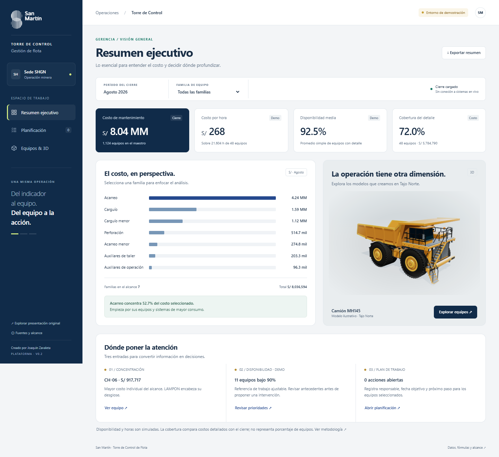

# Torre de Control de Flota

## Propuesta visual · septiembre 2026

La entrada vuelve al recorrido continuo de la referencia de Claude, con el tajo de fondo y el descenso hasta cada sistema del equipo. Incluye mejoras del camión procedural y controles de acabado, tolva e inspección. Las herramientas de gestión anteriores se conservan en `gestion.html`.

Para reconstruir esta entrada: `pnpm build:relato`. Fuentes: `src/relato.*`. Para pruebas: `pnpm test` y `pnpm test:ui`. El build completo conserva también los bundles de gestión. Estado de entrega/publicación en [MEMORIA.md](docs/MEMORIA.md).

Lo que sigue describe la plataforma v0.2 conservada como herramienta de gestión.

**Una plataforma para pasar del indicador al equipo y del equipo a la acción.**

[Abrir plataforma](https://fernlox753.github.io/torre-control-flota/) · [Presentación original](https://fernlox753.github.io/torre-control-flota/presentacion.html) · [Memoria para continuar el proyecto](docs/MEMORIA.md)

San Martín · sede SHGN. Creado por **Joaquin Zavaleta**. Versión **0.2.0**, septiembre de 2026.



## Recorridos

- **Gerencia:** costo del cierre, costo por hora, disponibilidad media y cobertura del detalle; distribución por familia y entradas al análisis individual.
- **Planificación:** búsqueda por equipo, modelo o sistema; referencia de disponibilidad ajustable; prioridades explicadas; acciones con responsable, fecha y estado.
- **Equipos y mantenimiento:** costos por sistema, materiales y servicios, antecedentes de OT y modelos 3D de Tajo Norte con cámara y animaciones.

El período, la familia y el equipo se comparten entre las vistas y pueden conservarse en el enlace. Las vistas son recorridos de trabajo, **no roles de seguridad**.

## Alcance actual

Es una **demostración funcional**, publicada como sitio estático. El cierre de agosto de 2026 incluye S/ 8,036,594 por familia y detalle de 48 equipos por S/ 5,784,790. Horas y disponibilidad son simuladas. No hay conexión en vivo a SAP/CMMS, presupuesto, metas aprobadas ni estados operativos reales.

Las acciones se guardan en el navegador y se pueden exportar/importar como JSON. No se sincronizan entre usuarios y no crean órdenes de trabajo en otro sistema. El resumen se exporta a CSV.

Camión MH145, pala PS50FS y tractor TD50 proceden de [Tajo Norte](https://github.com/Fernlox753/tajo-norte). Son modelos ilustrativos, no réplicas certificadas de los equipos del cierre. El 3D se descarga solo al activarlo; los datos y la imagen siguen disponibles si falla WebGL.

## Desarrollo

Requiere Node.js 22 o posterior y pnpm. Para los tests de interfaz se usa Chrome instalado; puede seleccionarse otro canal de Playwright con `PLAYWRIGHT_CHANNEL`.

```sh
pnpm install --frozen-lockfile
pnpm build
pnpm test
pnpm test:ui
python -m http.server 8766 --bind 127.0.0.1
```

Abrir `http://127.0.0.1:8766`. No abrir `index.html` con `file://`, porque los módulos y modelos requieren HTTP. Los usuarios de la página publicada no necesitan instalar nada.

Se edita `src/`; `pnpm build` genera `assets/build/`. Se versionan ambos para GitHub Pages, configurado en `main`, carpeta raíz. Las rutas son relativas y funcionan bajo `/torre-control-flota/`.

## Continuidad

1. [AGENTS.md](AGENTS.md): instrucciones iniciales para cualquier IA.
2. [MEMORIA.md](docs/MEMORIA.md): intención del usuario, decisiones, trabajo entregado y siguientes pasos.
3. [DATOS.md](docs/DATOS.md): procedencia, cobertura, fórmulas y limitaciones.
4. [ARQUITECTURA.md](docs/ARQUITECTURA.md): estructura, estado, build y publicación.
5. [VALIDACION.md](docs/VALIDACION.md): pruebas realizadas y alcance de la revisión.
6. [CHANGELOG.md](CHANGELOG.md): cambios por versión.

**Cada entrega debe actualizar esta memoria.** Git conserva los cambios concretos y permite recuperar la versión anterior. No se debe depender del historial de un chat para continuar.

Licencias y atribuciones: [THIRD_PARTY_NOTICES.md](THIRD_PARTY_NOTICES.md).
